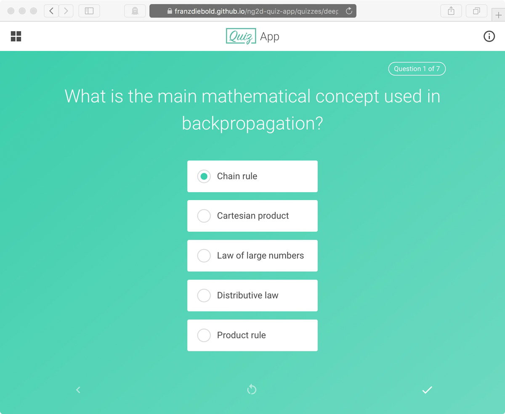

# QuizApp

[](./package.json)
<a href="https://franzdiebold.github.io/ng2d-quiz-app/" target="_blank"></a>
[](./LICENSE.md)

> Check out the [live demo](https://franzdiebold.github.io/ng2d-quiz-app/)!




[Angular v6](https://github.com/angular/angular) app using the reactive libraries [@ngrx](https://github.com/ngrx/platform) and the [Bulma](https://bulma.io) CSS framework.
The quizzes and questions are retrieved from the [QuizServer](../quiz-server) JSON backend. 

Angular concepts/techniques used:
- [Reactive Forms](https://angular.io/guide/reactive-forms)
- [Internationalization (i18n)](https://angular.io/guide/i18n)
- [Route guards](https://angular.io/guide/router#milestone-5-route-guards)

[@ngrx](https://github.com/ngrx/platform) features used:
- [@ngrx/store](https://github.com/ngrx/platform/blob/master/docs/store/README.md) for state management
- [@ngrx/effects](https://github.com/ngrx/platform/blob/master/docs/effects/README.md) for side effects
- [@ngrx/router-store](https://github.com/ngrx/platform/blob/master/docs/router-store/README.md) for connecting the Angular router
- [@ngrx/entity](https://github.com/ngrx/platform/blob/master/docs/entity/README.md) as entity state adapter
- [ngrx-store-localstorage](https://github.com/btroncone/ngrx-store-localstorage) for using the local storage in state management

Other packages used:
- [angular2-uuid](https://github.com/wulfsolter/angular2-uuid) for generating UUIDs
- [angular-sortablejs](https://github.com/SortableJS/angular-sortablejs) for reorderable drag-and-drop lists


## 🎬 Installation
```sh
git clone https://github.com/FranzDiebold/ng2d-quiz-app.git
cd ng2d-quiz-app
npm install
```


## 🎛 Configuration
In `src/environments/environment.[prod].ts` you may change the `apiEndpoint` of the corresponding backend, the `colors` used and the text colors `brightTextColor` and `darkTextColor`:
```typescript
export const environment = {
  ...,
  apiEndpoint: 'https://script.google.com/macros/s/AKfycbzqMQJLt49HZcOgAYItiv2GljX5SfyMs0A5KTSUVwq3idDbweez/exec',
  colors: [
    '#540D6E',
    '#EE4266',
    '#FFD23F',
    '#3BCEAC',
    '#0EAD69',
  ],
  brightTextColor: '#ffffff',
  darkTextColor: '#494949',
};
```
The text color (bright or dark) is chosen automatically depending on the background color luminance.

In `src/variables.scss` you may change the color scheme:
```scss
$color-primary: #3BCEAC;
$color-secondary: #29a588;
$color-text: #494949;
$color-gray: #959595;
$color-light-gray: #959595;
$color-correct: #00aa00;
$color-incorrect: #aa0000;
```


## :earth_africa: i18n
If you want to add a new language, i.e. french:

1. Run `ng xi18n`.
2. Copy newly generated file `src/messages.xlf` to `src/locale/messages.fr.xlf` and add `<target>...</target>` for each `<source>...</source>`.
3. Serve for test: `ng serve --aot --locale fr --i18n-format xlf --i18n-file src/locale/messages.fr.xlf`


## :rocket: Build
Build for production:

`ng build --prod`

Using the german locale (`src/locale/messages.de.xlf`):

`ng build --locale de --i18n-format xlf --i18n-file src/locale/messages.de.xlf --prod`


## Build and deploy for GitHub Pages

Using the [angular-cli-ghpages](https://github.com/angular-schule/angular-cli-ghpages) package:

Install package:
`npm install -g angular-cli-ghpages`

In `quiz-app` folder, build the Angular client app using your GitHub Pages url as base url:

`ng build --prod --base-href "https://<USERNAME>.github.io/<REPOSITORY_NAME>/"`

In the root folder `ng2d-quiz-app` run the `angular-cli-ghpages` command with the `--dir` option pointing to the `dist` folder of the `quiz-app`:

`angular-cli-ghpages --dir quiz-app/dist --no-silent`

Your Angular client app should now be available at `https://<USERNAME>.github.io/<REPOSITORY_NAME>/`.


## :ballot_box_with_check: TODOs
- [ ] Update @ngrx when out of beta (v6)
- [ ] Add social sharing
