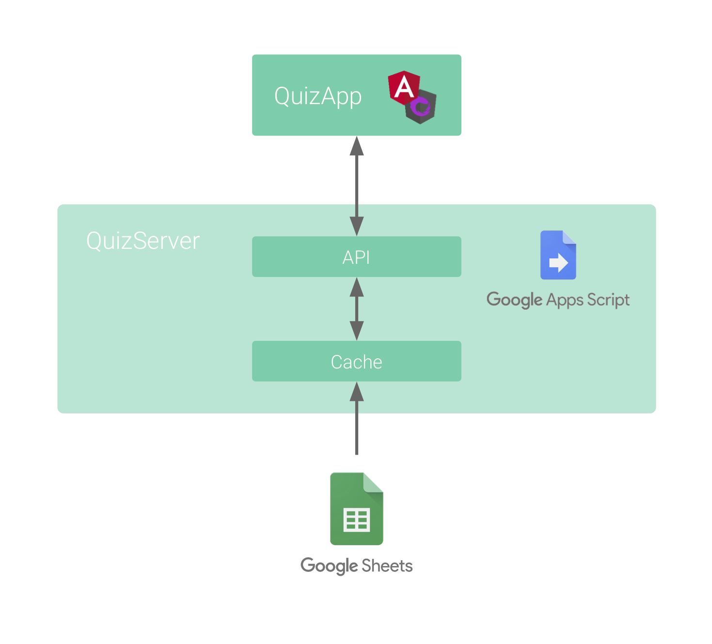
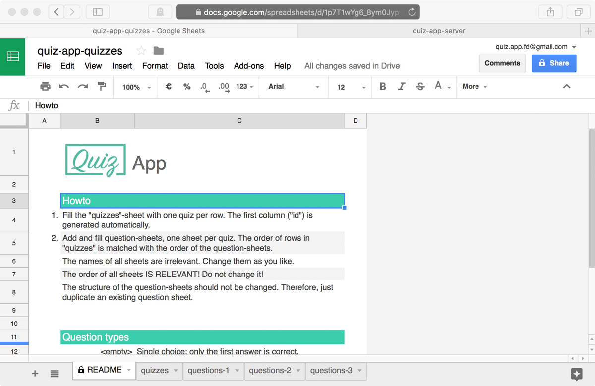
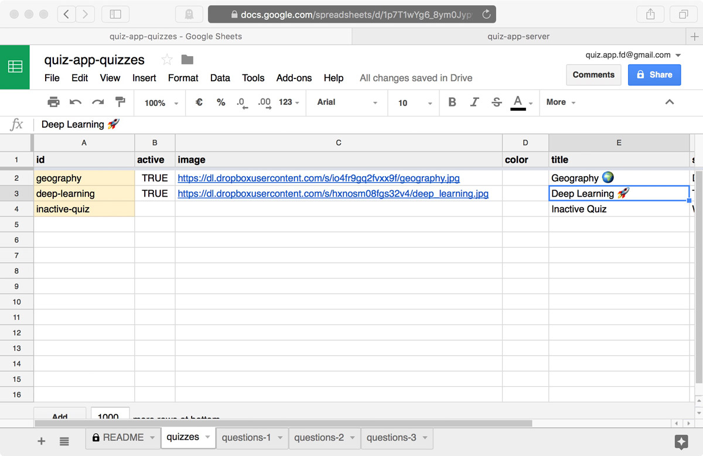
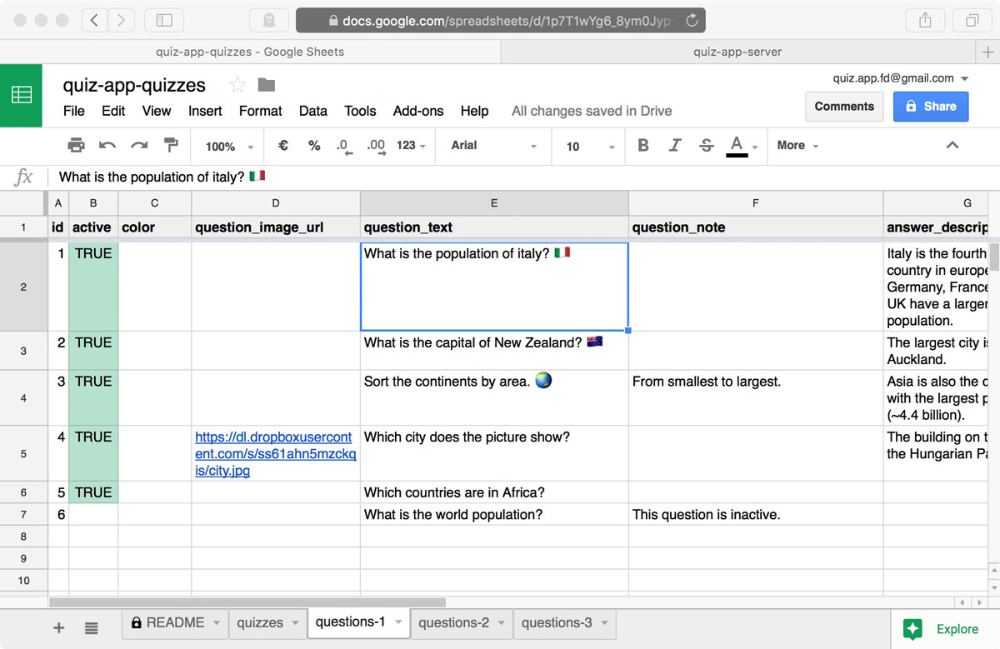
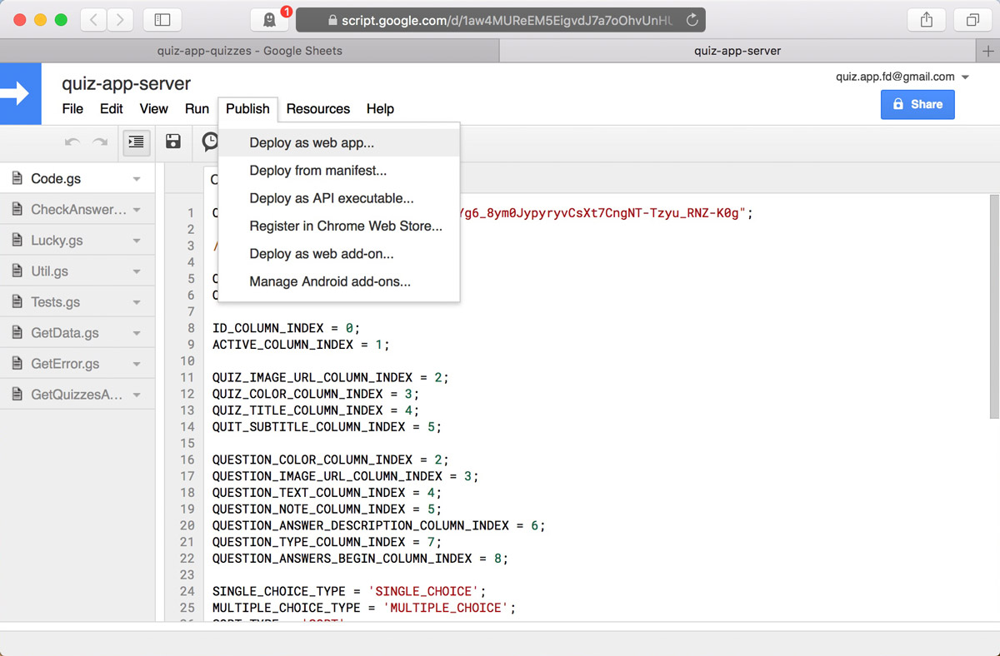
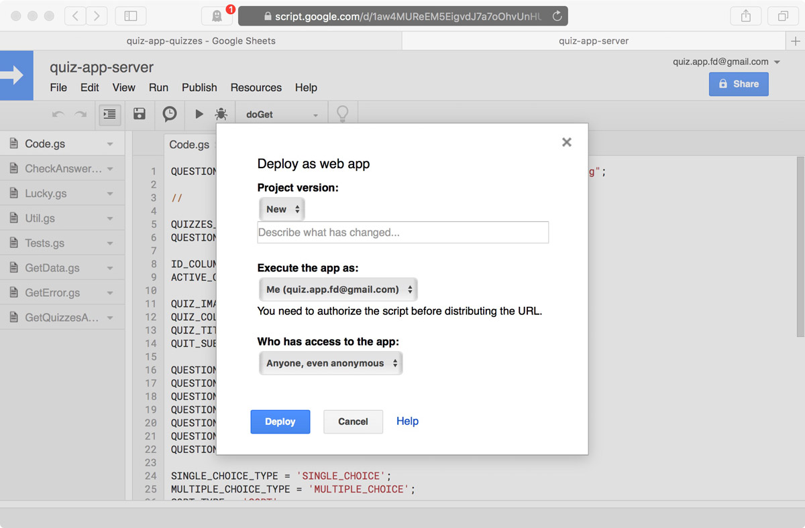

# QuizServer

QuizServer is the *stateless* JSON backend of the ng2d-quiz-app using [Google Apps Script](https://developers.google.com/apps-script/).
All data for quizzes, questions and answers are stored in a Google Sheet and can thus be easily changed, even on a mobile device.



The requirement for the backend is to serve the questions and answers in a *randomized* order, while being stateless at the same time.
This is achieved by using a random seed:
The [QuizApp](../quiz-app) client app generates a random seed on start-up, which is kept constant over the entire client app lifetime. This seed is sent with every request and used for shuffling the questions and answers.


## :dart: API endpoints

#### getQuizzesAndQuestions
Retrieve all existing and active quizzes with their corresponding questions and answers.

**Request**

`GET` `https://script.google.com/macros/s/<WEBAPP_ID>/exec?seed=<SEED>`

**Response**
```json
[
  {
    "id": "geography",
    "imageUrl": "https://dl.dropboxusercontent.com/s/io4fr9gq2fvxx9f/geography.jpg",
    "color": "",
    "title": "Geography 🌍",
    "subtitle": "Do you know our planet?",
    "questions": [
      {
        "id": "1",
        "type": "SINGLE_CHOICE",
        "color": "",
        "imageUrl": "",
        "text": "What is the population of italy? 🇮🇹",
        "note": "",
        "shuffledAnswers": [
          "140 million",
          "22 million",
          "7 billion",
          "60 million"
        ]
      },
      ...
    ]
  },
  ...
]

```


#### checkAnswer

Check a given answer for a specific question in a quiz.

**Request**

`GET` `https://script.google.com/macros/s/<WEBAPP_ID>/exec?quiz_id=<QUIZ_ID>&seed=<SEED>&question_id=<QUESTION_ID>&answer=<ANSWER>`

**Response**
```json
{
  "isCorrect": true,
  "correctAnswer": 2,
  "answerDescription": "Italy is the fourth largest country in europe. Only Germany, France and the UK have a larger population."
}
```


## :ballot_box_with_check: Sheet Preparation
1. Get the `quiz-app-quizzes` Google Sheet template:
    1. Log in to your Google account.
    2. Open the [quiz-app-quizzes](https://docs.google.com/spreadsheets/d/1p7T1wYg6_8ym0JypyryvCsXt7CngNT-Tzyu_RNZ-K0g/edit?usp=sharing) Google Sheet template.
    3. Click `File`.
    4. Choose `Make a copy...` and copy the sheet into your Google Drive.
2. Fill the sheet with your quizzes and questions:
    - The template contains all possible setting options. They are mostly self-explaining, so just try out and have fun 🙃.
    - The first sheet is a short `README`:
    - 
    - You need to provide images for quizzes and may provide images for questions. The best practice for serving these images is to use [Dropbox](https://www.dropbox.com):
        1. Share the image (*"Anyone with the link can view this file."*) and get the link.
        2. Transform the link as follows: `https://www.dropbox.com/s/<IMAGE_ID>/<IMAGE_NAME>` → `https://dl.dropboxusercontent.com/s/<IMAGE_ID>/<IMAGE_NAME>`.
    - 
    - 
3. Copy the ID of your new `quiz-app-quizzes` sheet, it is needed in the configuration step later. The ID is part of the URL: `https://docs.google.com/spreadsheets/d/<YOUR_SPREADSHEET_ID>/edit`


## :clapper: Script Installation
1. Get the `quiz-app-server` `Google Script` (`.gs`) code 🤓:
    1. Log in to your Google Account.
    2. Open the [quiz-app-server](https://script.google.com/d/1aw4MUReEM5EigvdJ7a7oOhvUnHU91UAkoLr-bxRbY66JeDci1iXJQSZO/edit?usp=sharing) Google Apps Script project template.
    3. Click `File`.
    4. Choose `Make a copy...`.
    5. The code can also be found in `quiz-server/src/`.
2. 🎛 Configure your new script:
    In `Code.gs` you need to set the `QUESTION_SPREADSHEET_ID`:
    ```gs
    QUESTION_SPREADSHEET_ID = "<YOUR_SPREADSHEET_ID>";
    ```


## :rocket: Deployment
The deployment of the QuizServer works as follows:
1. Click `Publish`.
    - 
2. Choose `Deploy as webapp...`.
3. In the popup make the following settings:
    - 
    - `Execute the app as:` `Me: (<YOUR_GOOGLE_ACCOUNT>)`
    - `Who has access to the app:`: `Anyone, even anonymous`
4. Click `Deploy`/`Update`. You may have to give permission for the script to access the Google Sheet:
    1. Click `Review Permissions`.
    2. Choose your Google Account.
    3. Since your app isn't verified, click `Advanced` in the bottom left.
    4. Click `Go to quiz-app-server (unsafe)`.
    5. Click `Allow`.
5. Copy the `Current web app URL`. You will need this link for the client `quiz-app` app as `apiEndpoint`.
6. Click `OK`.
